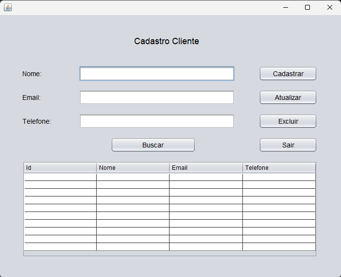
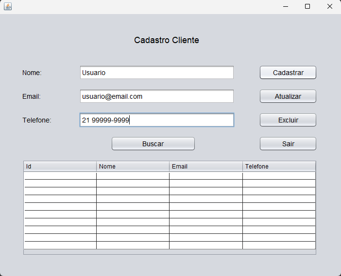
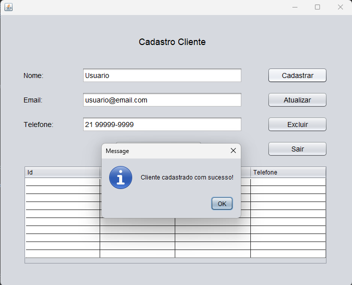
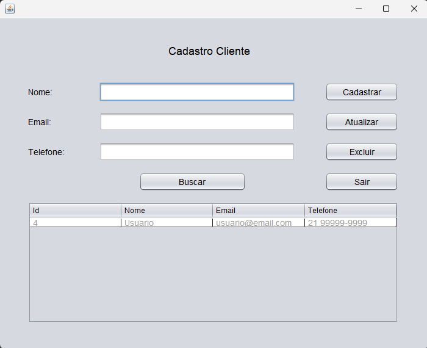
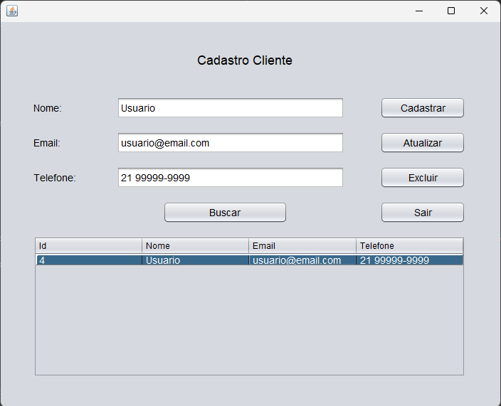
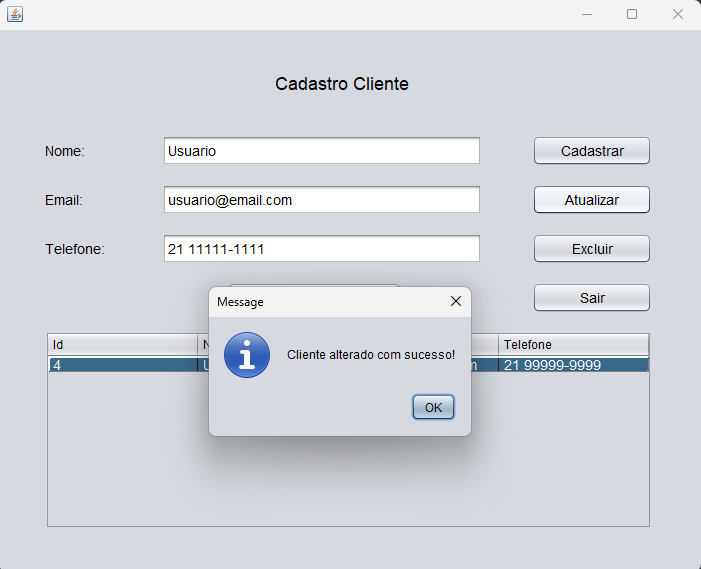
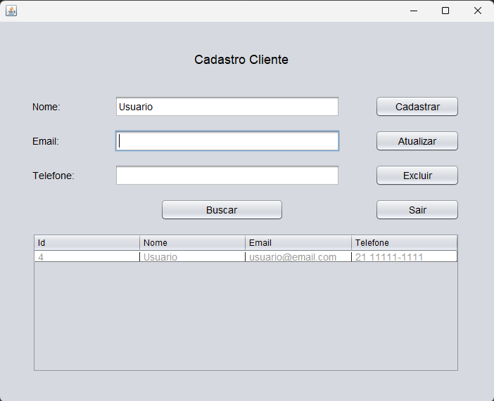
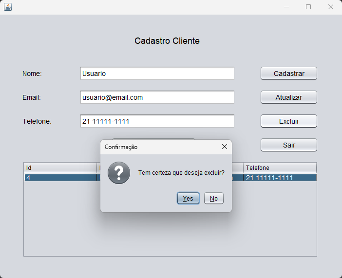
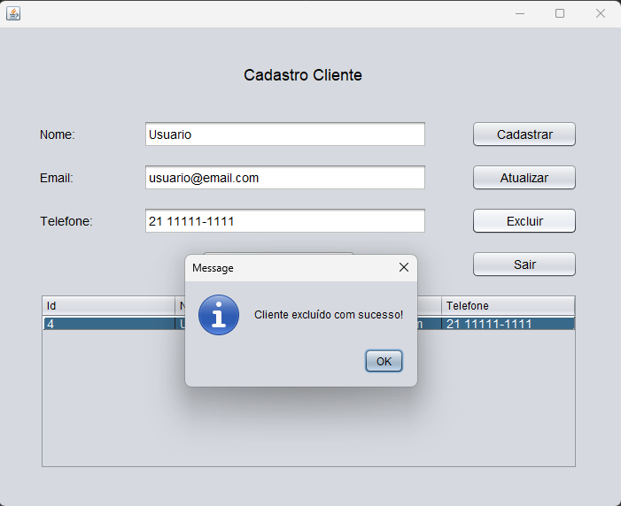

CRUD de Clientes - Java Swing

Sistema CRUD completo desenvolvido em Java utilizando Swing e JDBC com MySQL.

FUNCIONALIDADES

- Cadastro de clientes
- Listagem em tabela
- Busca por nome
- Atualização de dados
- Exclusão com confirmação
- Clique na tabela preenche os campos

TECNOLOGIAS

- Java
- Swing
- JDBC
- MySQL

INTERFACE

COMO EXECUTAR

1. Clone o projeto:

https://github.com/PHVermelho/crud-java-swing-clientes/tree/main

2. Configure o banco:
- Execute o script em `database/script.sql`

3. Configure a conexão no projeto:
- Ajuste usuário e senha no `ConnectionFactory`

4. Execute o projeto

AUTOR

Pedro Henrique Vermelho
